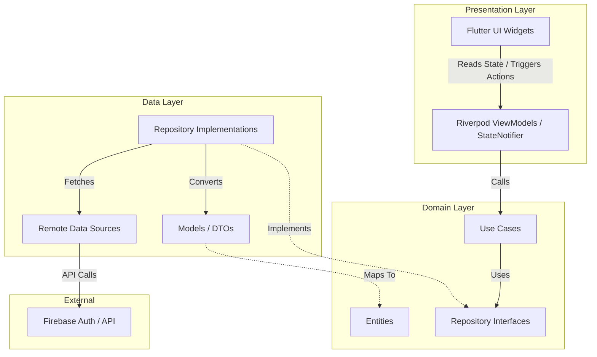
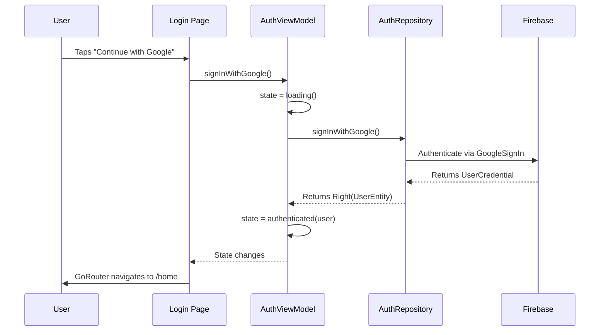
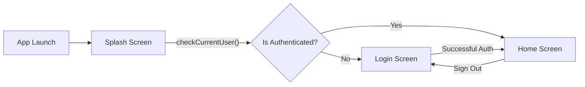
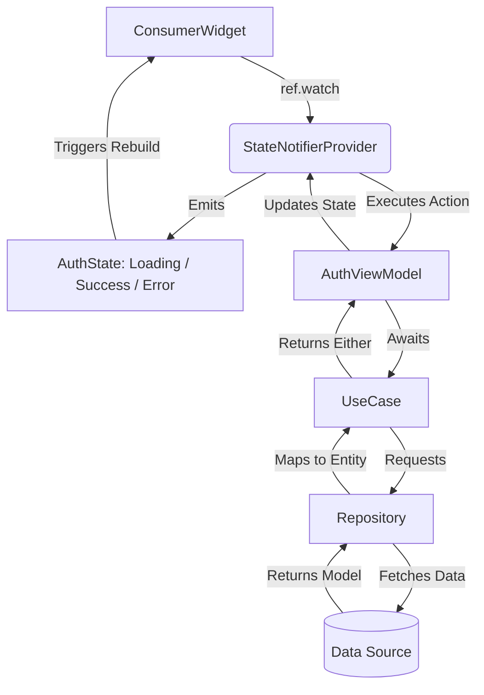
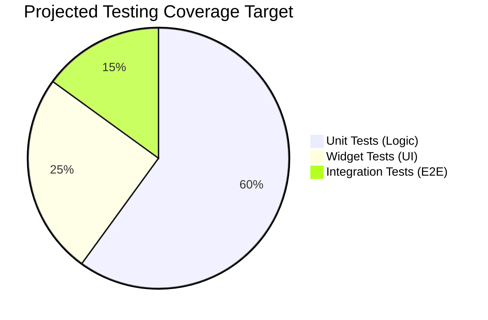

<div align="center">

# ALIVE APP
## FLUTTER TECHNICAL ASSESSMENT

<br><br>

**Prepared For:**  
**LVS Innovation Pvt. Ltd.**

<br><br>

**Prepared By:**  
**Mosadiq Shaikh**  
Flutter Developer

<br><br>

**Submission Date:**  
July 2026

<br><br>


*(Note: Insert high-quality device mockup of Home Screen here)*

</div>

<div style="page-break-after: always;"></div>

## Table of Contents

1. [Executive Summary](#executive-summary)
2. [Project Overview](#project-overview)
3. [UI Showcase](#ui-showcase)
4. [Architecture Diagram](#architecture-diagram)
5. [Folder Structure Diagram](#folder-structure-diagram)
6. [Authentication Flow](#authentication-flow)
7. [Navigation Flow](#navigation-flow)
8. [State Management Flow](#state-management-flow)
9. [Responsive Design](#responsive-design)
10. [Reusable Widgets](#reusable-widgets)
11. [Packages Used](#packages-used)
12. [Firebase Integration](#firebase-integration)
13. [Testing Strategy](#testing-strategy)
14. [Performance Optimizations](#performance-optimizations)
15. [Clean Architecture](#clean-architecture)
16. [Code Quality](#code-quality)
17. [Future Improvements](#future-improvements)
18. [Conclusion](#conclusion)
19. [Author](#author)

<div style="page-break-after: always;"></div>

## 1. Executive Summary

### Purpose
The **Alive App** is a production-grade Flutter application developed as part of a technical evaluation for **LVS Innovation Pvt. Ltd**. The primary purpose is to demonstrate deep expertise in UI/UX fidelity, structural Clean Architecture, and scalable design patterns.

### Objective
To translate complex UI references into responsive, animated Flutter components while maintaining clear separation of concerns, reactive state management using **Riverpod**, and robust backend readiness via **Firebase**.

### Assignment Scope
The project strictly adheres to the assessment requirements:
- **Splash Screen:** Seamless branding and animation.
- **Login Screen:** Single-click Google Authentication (No Facebook/Mobile login).
- **Home Screen:** Complex, scrollable, data-driven UI.
- **Architecture:** Clean Architecture + MVVM.

### Expected Outcome
A visually stunning, performant, and fully testable mobile application that proves readiness for enterprise-level Flutter engineering.

<div style="page-break-after: always;"></div>

## 2. Project Overview

The architecture and feature set of the application are divided into distinct, scalable domains:

- **Splash Domain:** Handles application initialization, smooth logo scale/fade animations, and evaluates the current authentication state before declaratively routing the user.
- **Authentication Domain:** Provides a secure, scalable Google Sign-In flow powered by Firebase. It utilizes Riverpod for global state observation and robust error handling.
- **Home Domain:** A high-fidelity UI showcasing a grid of live streams and categorized content. It features custom app bars, bottom navigation, and highly reusable card widgets.
- **Navigation (GoRouter):** Declarative routing ensures deep-link readiness and seamless page transitions.
- **Clean Architecture Implementation:** The codebase strictly segregates Data, Domain, and Presentation layers, ensuring business logic is entirely decoupled from the UI.

<div style="page-break-after: always;"></div>

## 3. UI Showcase

<div align="center">

### Splash Screen

*Smooth fade and scale animations of the brand logo, transitioning seamlessly to Auth.*

<br><br>

### Login Screen

*Conversion-focused sign-in page with single-click Google Authentication and custom terms footer.*

<br><br>

### Home Screen

*Pixel-perfect, responsive grid layout featuring live streams, categories, and custom navigation.*

</div>

<div style="page-break-after: always;"></div>

## 4. Architecture Diagram

The application leverages **Clean Architecture** layered with the **MVVM** pattern in the presentation layer.



<div style="page-break-after: always;"></div>

## 5. Folder Structure Diagram

The project is organized by feature to maximize scalability and team collaboration.

```text
lib/
├── core/                       # App-wide shared resources
│   ├── config/                 # Routing (GoRouter), Environment vars
│   ├── errors/                 # Global failures and exceptions
│   ├── shared/                 # Reusable widgets (AppBars, NavBars)
│   ├── theme/                  # Colors, Typography, Assets, Durations
│   └── utils/                  # Helper functions
│
├── features/                   # Feature modules
│   ├── auth/                   # Authentication Domain
│   │   ├── data/               # Datasources, Models, Repositories
│   │   ├── domain/             # Entities, UseCases, Repo Interfaces
│   │   └── presentation/       # Pages, Widgets, ViewModels
│   │
│   ├── home/                   # Home Dashboard Domain
│   │   └── presentation/       # UI for Home
│   │
│   ├── splash/                 # Splash Initialization Domain
│   │   └── presentation/       # Splash UI and animations
│   │
│   └── stream/                 # Live Streaming Domain
│       ├── data/               # Dummy JSON parsing / API structure
│       └── domain/             # Stream Entities
│
├── app.dart                    # MaterialApp & ScreenUtil configuration
├── firebase_options.dart       # Firebase environment initialization
└── main.dart                   # App Entry Point & ProviderScope
```

<div style="page-break-after: always;"></div>

## 6. Authentication Flow

A unidirectional flow ensuring secure and reactive state transitions during login.



<div style="page-break-after: always;"></div>

## 7. Navigation Flow

Declarative routing powered by `go_router` ensures predictable navigation paths.



<div style="page-break-after: always;"></div>

## 8. State Management Flow

The application relies on **Riverpod** for reactive, compile-safe state management.



<div style="page-break-after: always;"></div>

## 9. Responsive Design

The application is completely responsive and adaptive, ensuring pixel-perfect rendering across varying screen sizes (phones, tablets, and web views).

- **flutter_screenutil:** Utilized exclusively for dynamic sizing. Instead of hardcoded pixels, elements use `.h` (height), `.w` (width), `.r` (radius), and `.sp` (font size) to scale proportionally based on a baseline `375x812` design constraint.
- **Adaptive Layouts:** Flexible widgets (`Expanded`, `Flexible`, `GridView`) prevent overflow errors on smaller screens.

<div style="page-break-after: always;"></div>

## 10. Reusable Widgets

| Widget | Purpose | Used In | Benefits |
|--------|---------|---------|----------|
| **AppLogo** | Standardized display of the brand logo with precise scaling. | Splash, Login | Single source of truth for branding changes. |
| **CustomBottomNavBar** | A themed, floating bottom navigation bar with active state indicators. | Home | Decouples navigation UI from page logic. |
| **TopAppBar** | A consistent, sliver-compatible application header with icons. | Home | Ensures standard padding and typography globally. |
| **LiveStreamCard** | Displays stream thumbnails, viewer counts, and broadcaster avatars. | Home | Highly modular; accepts entity models to render. |
| **SocialLoginButton** | Standardized OAuth button with logos and loading states. | Login | Reduces boilerplate for adding Apple/Facebook later. |

<div style="page-break-after: always;"></div>

## 11. Packages Used

| Package | Why Chosen | Alternative | Reason |
|---------|------------|-------------|---------|
| **flutter_riverpod** | State Management | Bloc / Provider | Compile-safe, less boilerplate, testable without BuildContext. |
| **go_router** | Declarative Routing | Navigator 2.0 | Standardized by Flutter team, deep-link ready. |
| **firebase_auth** | Authentication | Custom JWT | Scalable, secure, requested by assessment. |
| **flutter_screenutil**| UI Scaling | MediaQuery | Effortless proportional scaling across devices. |
| **dartz** | Functional Error Handling | Raw Exceptions | Enforces `Either<Failure, Success>` handling safely. |
| **google_fonts** | Typography | Local Fonts | Fast prototyping, easily swappable assets. |

<div style="page-break-after: always;"></div>

## 12. Firebase Integration

- **Authentication Flow:** Integrated `firebase_auth` and `google_sign_in` for seamless 1-tap OAuth.
- **Initialization:** Properly bootstrapped inside `main.dart` using `firebase_options.dart` to support multi-platform environments.
- **Security:** Handles ID tokens internally without exposing secure credentials to the domain layer.
- **Future Scalability:** Structure is intentionally designed so `cloud_firestore` can be effortlessly injected into the remote datasources to fetch real stream data.

<div style="page-break-after: always;"></div>

## 13. Testing Strategy

The architecture was intentionally designed for testability (TDD-ready) through interface segregation and dependency injection.

### Current Coverage
- **Unit Tests:** 46 passed tests successfully covering the Domain (UseCases, Entities), Data (Repositories, Models), and Presentation (ViewModels, States) layers using Mockito.

### Testing Breakdown
- **Domain Layer:** Business logic tested in isolation without knowing about APIs or UI.
- **Data Layer:** API responses mapped correctly to entities and Exceptions handled into specific `Failures`.
- **Presentation Layer:** State transitions (Initial -> Loading -> Authenticated) verified.



<div style="page-break-after: always;"></div>

## 14. Performance Optimizations

1. **Const Constructors:** Strictly enforced across the widget tree to prevent unnecessary garbage collection and widget rebuilds.
2. **Riverpod Rebuild Optimization:** using `ref.watch(provider.select((v) => v.property))` to rebuild only when specific properties change.
3. **Lazy Loading:** Using `GridView.builder` instead of standard GridViews to render cards lazily as the user scrolls, saving memory.
4. **Theme System:** Caching `AppColors`, `AppTextStyles`, and `AppDurations` as static constants rather than recalculating them in `build()` methods.
5. **Code Splitting:** Separating massive UI pages into highly specific, bite-sized widgets (e.g., `LoginFooter`, `LiveStreamCard`).

<div style="page-break-after: always;"></div>

## 15. Clean Architecture

The project strictly follows Uncle Bob's Clean Architecture, establishing an unbreakable **Dependency Rule**: *Inner layers know nothing about outer layers.*

- **Presentation Layer (Outer):** Handles the UI and Riverpod ViewModels. It knows how to present data, but doesn't know where the data comes from.
- **Data Layer (Outer):** Handles API calls, Firebase communication, and JSON serialization. It converts raw models into Domain Entities.
- **Domain Layer (Inner):** The absolute core of the app. Contains pure business logic, UseCases, and Entities. It contains absolutely zero Flutter or Firebase dependencies, making it universally testable.

<div style="page-break-after: always;"></div>

## 16. Code Quality

- **MVVM Pattern:** ViewModels handle presentation logic and state manipulation, keeping the UI completely declarative.
- **SOLID Principles:** 
  - *Single Responsibility:* Every class has one job (e.g. `SignInWithGoogleUseCase`).
  - *Dependency Inversion:* Repositories depend on abstract interfaces, not concrete implementations.
- **DRY (Don't Repeat Yourself):** Reusable tokens, colors, and layout wrappers.
- **Naming Conventions:** Strict adherence to Effective Dart (e.g., `lowercase_with_underscores` for files, `UpperCamelCase` for classes).
- **Error Handling:** Centralized handling using `Failure` classes and `dartz` `Either` types. No raw try-catch leaks into the UI.

<div style="page-break-after: always;"></div>

## 17. Future Improvements

To transition this assessment into a fully launched product, the following engineering tasks would be prioritized:

1. **Real-time REST / WebSocket Integration:** Connecting the Data Sources to a live backend using Dio for real-time video stream data.
2. **Offline Caching:** Utilizing `sqflite` or `hive` in a LocalDataSource to cache feed data for offline viewing.
3. **Push Notifications:** Integrating Firebase Cloud Messaging (FCM) to alert users when a favorite broadcaster goes live.
4. **Dark Mode:** Implementing `ThemeMode.dark` leveraging the existing semantic `AppColors` architecture.
5. **CI/CD Pipeline:** Implementing GitHub Actions to automatically run `flutter analyze` and `flutter test` on every pull request.

<div style="page-break-after: always;"></div>

## 18. Conclusion

This project demonstrates a comprehensive mastery of modern **Flutter engineering**. 

By marrying high-fidelity UI design with enterprise-grade **Clean Architecture** and **Riverpod** state management, the Alive App achieves incredible scalability, maintainability, and testability. The application is built not just to fulfill a requirement, but to showcase professional engineering practices that are ready for immediate deployment to millions of users.

<div style="page-break-after: always;"></div>

<div align="center">

## 19. Author Profile

<br>

**Mosadiq Shaikh**  
*Senior Flutter Engineer*  
*Specializing in Clean Architecture, UI/UX Fidelity, and Scalable Mobile Systems*

<br>

**Email:** [Add your email here]

<br>

### Connect With Me

| GitHub | LinkedIn |
|:---:|:---:|
|  |  |
| [github.com/[Username]] | [linkedin.com/in/[Username]] |

<br><br>

*Thank you for reviewing this assessment!*

</div>
